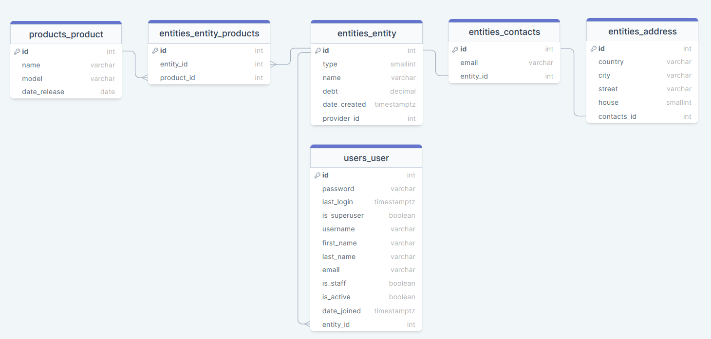

# Тестовое задание для RocketData
Выполненные пункты из Части 1: все.<br>
Выполненные пункты из Части 2: все.<br>
<hr>
<h2>Документация и навигация для проверяющего</h2>
Файлы настроек находятся в директории config.
Все приложения и модуль core находятся в директории src.
Каждый класс и функция содержит в себе маленькую документацию функционала.
Перед использованием следует настроить файл .env.template и вписать туда переменные окружения. После нужно
прописать команду, находясь в директории rocketdata (если вы используете Windows, то вместо cp напишите copy)

```commandline
   cp .env.template .env
```

Также следует сделать миграции.
<br>
<h3>Часть 1</h3>
<b>Пункт 1.</b> Внутренняя иерархия реализована через два поля в модели звена сети (далее сущность): 
type и provider. Поле type может принимать в себя значения [0, 4], где 0 - Завод ... 4 - Индивидуальный 
предприниматель. Поле provider является внешним ключом на модель сущности. При создании и обновлении модели 
происходит валидация на входящие данные для полей type и provider.type (нельзя указать как поставщика того, 
кто ниже по иерархии).<br><br>
<b>Пункт 2.</b> В сети фигурирует шесть моделей. Модели Entity, Contacts, Address находятся в приложении entities, 
Product - в products, User (Сотрудники) - в users. При создании новой сущности для нее автоматически 
создаются поля в Contacts и Address. Связь Entity - Contacts: один к одному. Связь Contacts - Address: 
один к одному. Связь Entity - User: один ко многим. Связь Entity - Entity.provider: многие к одному. 
Связь Entity - Products: многие ко многим через таблицу entities_entity_products. 
Выбор связи многие ко многим обусловлен тем, что разные сущности могут поставлять один и тот же продукт, но 
в таком случае этот один и тот же продукт будет дублироваться в таблице products_product. Дабы этого 
избежать, была реализована связь многие ко многим. Если развивать эту философию, то можно добавить в модель 
Product внешний ключ owner, ссылающийся на Entity, который будет показывать владельца продукта 
(владельцем продукта iPhone 11 будет завод Apple). Нужен он будет для того, чтобы можно было реализовать 
функционал, который запрещал бы изменения для продукта, если его пытается изменить не владелец. Однако, 
эта мысль мне пришла слишком поздно, поэтому реализовать ее не вышло, но это вполне себе легко и возможно.<br>
Диаграмма таблиц и их связей в базе данных<br>

<br><br>
<b>Пункт 3.</b> Реализованы все требования.<br><br>
<b>Пункт 4.</b> Все представления, связанные с сущностями находятся в файле /entities/views.py. 
Все представления, связанные с продуктами находятся в файле /products/views.py.<br>
 
 - <b>4.1</b> URL: http://127.0.0.1:8000/api/v1/entities/all. View: EntityListAPIView.
 - <b>4.2</b> URL: http://127.0.0.1:8000/api/v1/entities/country?name={}. View: EntityCountryAPIView.
 - <b>4.3</b> URL: http://127.0.0.1:8000/api/v1/entities/debt. View: EntityDebtGreaterThanAvgAPIView.
 - <b>4.4</b> URL: http://127.0.0.1:8000/api/v1/entities/product?id={}. View: EntityProductIDAPIView.
 - <b>4.5 - 4.6</b> 
   - <b>Создание сущности.</b> URL: http://127.0.0.1:8000/api/v1/entities/create. View: EntityCreateAPIView.
   - <b>Обновление/удаление сущности.</b> URL: http://127.0.0.1:8000/api/v1/entities/{id}. View: EntityUpdateDestroyAPIView.
   - <b>Создание продукта.</b> URL: http://127.0.0.1:8000/api/v1/products/create. View: ProductCreateAPIView.
   - <b>Обновление/удаление продукта.</b> URL: http://127.0.0.1:8000/api/v1/products/{id}. View: ProductUpdateDestroyAPIView.

<b>Пункт 5.</b> Аутентификация пользователя происходит с использованием JSON Web Token, который можно 
сгенерировать по URL: http://127.0.0.1:8000/auth/jwt/create/, предоставив свои реквизиты. Логика прав 
доступа к API описана классом IsActivePermission в файле /core/permissions.py. Этот класс был указал в 
глобальных настройках доступа к API.

<h3>Часть 2</h4>
<b>Пункт 1.</b> Для заполнения базы данных были использованы кастомные миграции, где были описаны создаваемые
объекты и зависимости.<br><br>
<b>Пункт 2.</b> В проекте Celery использует базу данных Redis, которая выступает в роли брокера. 
Для работы с Celery нужно запустить docker контейнер командой (если вы используете Windows, то sudo писать не нужно)

````commandline
    sudo docker run -d -p 6379:6379 redis
```` 

Либо, если на компьютере установлен Redis, поднять сервер Redis с портом прослушивания 6379. 
Чтобы использовать Celery, нужно запустить Celery worker и Celery beat в отдельных терминалах. 
Их запуск должен осуществляться в той же директории, где находится файл manage.py, то есть в 
директории /rocketdata/approot. Чтобы запустить Celery, нужно прописать в отдельном терминале команду

```commandline
   celery -A config worker -l info
```

И в еще одном терминале команду 

```commandline
   celery -A config beat -l info.
```

Неймспейс для Celery находится в settings.py. Настройки Celery /config/celery.py. 
Все Celery задачи написаны в /entities/tasks.py.

- <b>2.1</b> Задача является функцией increase_debt_beat(), настройка периодичности находится в /config/celery.py.
- <b>2.2</b> Задача является функцией decrease_debt_beat(), настройка периодичности находится в /config/celery.py.
- <b>2.3</b> Задача является функцией make_debt_zero_worker(), которая вызывается по условию в admin action.

<b>Пункт 3.</b> Электронное письмо с QR кодом отправляется на почту посредством API запроса на 
URL: http://127.0.0.1:8000/api/v1/entities/qrcode/{id}. QR код генерируется функцией make_qrcode(), 
которая находится в core/functions.py. Она также сохраняет результат в директории /entities/qrcodes. 
Электронное письмо отправляется Celery задачей, которая является функцией send_email_worker(), находящаяся 
в /entities/tasks.py. Она, в свою очередь, вызывает функцию send(), которая находится в /core/functions. 
Однако электронное письмо реально не приходит пользователю, потому что Google отключил возможность использовать 
свой SMTP сервер. Найти подходящие аналоги не удалось, поэтому письма приходят в консоль. 
В консоли невозможно просмотреть картинку и там она представлена как набор символов. Однако при получении такого 
же письма на реальную почту, картинку можно будет увидеть.<br><br>
<b>Пункт 4.</b> Все требования реализованы. Валидация даты происходит по формату и числу (если ввести
число позднее сегодняшнего, то пользователь получит предупреждение).<br><br>
<b>Пункт 5.</b> Получение информации только о своем объекте сети происходит по 
URL: http://127.0.0.1:8000/api/v1/entities/my. <br><br>
<b>Пункт 6.</b> HTML страницу можно получить по URL: http://127.0.0.1:8000/entities. На ней находится список 
всех сущностей. Рядом с электронной почтой каждой сущности есть кнопка 'Copy email', которая добавляет 
email в буфер обмена. Функция добавления находится в /entities/static/entities/copy.js. Сама HTML страница 
находится в /entities/templates/entities/index.html. Эту страницу рендерит Django представление 
EntityListView, которое находится в /entities/view_js.py.
